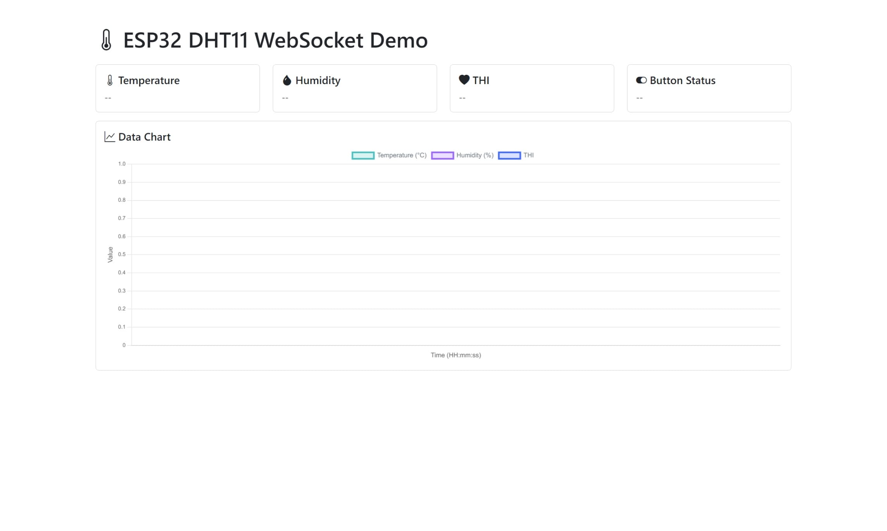
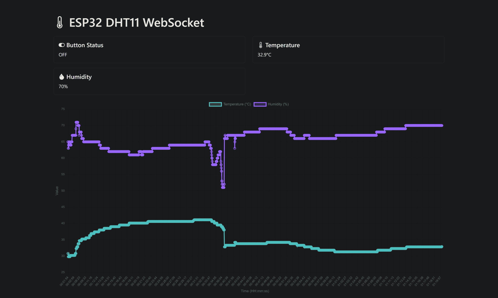
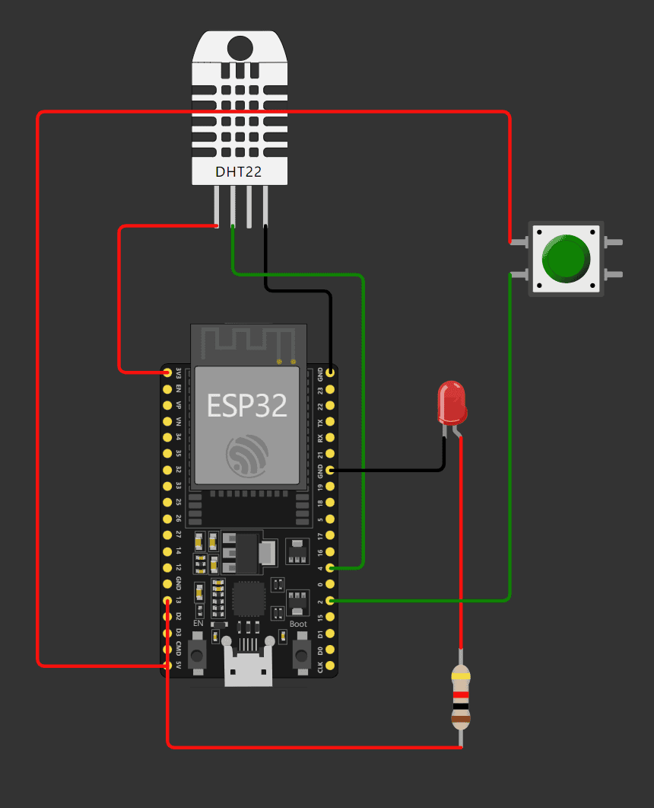
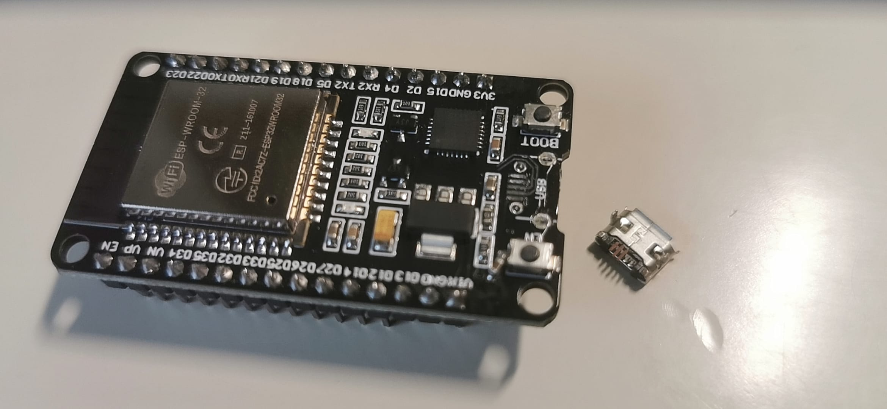

# ESP32 DHT11 WebSocket Demo

本项目使用WebSocket实现DHT11数据传输到客户端

客户端使用Bootstrap与Chart.js, 实现数据可视化, 通讯使用WebSocket实现

By WhatDamon & GLM4 & Qwen 2.5

客户端注释没怎么额外人工补充, 个人认为算比较好读的 (逃

本项目在个人的ESP-WROOM-32测试通过, 虽然代价是不小心把电源接口给干下来了......

## 截图

- **正式版:**

- **开发版:**

## 如何使用

### 服务端

请使用Arduino IDE打开`esp32`目录下的`dht11.ino`文件

注意请先安装好ESP32开发要用到的相关组件, 以及以下几个库

- [**WebSockets** by Markus Sattler](https://github.com/Links2004/arduinoWebSockets)
- [**DHT sensor library for ESPx** by beegee_tokyo](http://desire.giesecke.tk/index.php/2018/01/30/esp32-dht11/)
- [**ArduinoJson** by Benoit Blanchon](https://arduinojson.org/)

修改GPIO针脚以匹配你的需求, **一定记得修改WiFi的SSID和密码, 不然无法使用 (用于WebSocket)**

直接编译上传即可

这里提供一个示例, 乱画的, 但大致就是这个意思 *(DHT11就是这里的DHT22, 意思一下吧)*

### 客户端

您可以直接打开`index.html`, 可以直接查看

如果您需要局域网 (公网) 可以直接访问, 可以使用Python在代码根目录执行

~~~bash
python -m http.server 1000
~~~

之后就可以在可访问的设备中用端口号`1000`打开网页, 当然端口也可以人为修改!

您也可以使用NGINX、Apache Httpd, 只要你愿意ˋ( ° ▽、° ) 

## 其他内容

🌺🌺🌺🌺🌺奠🌺🌺🌺🌺🌺

为本项目开发而"牺牲"

*以后有机会重新焊接上去也不是不能用, 芯片没坏*

## 许可证

使用MIT许可证开源